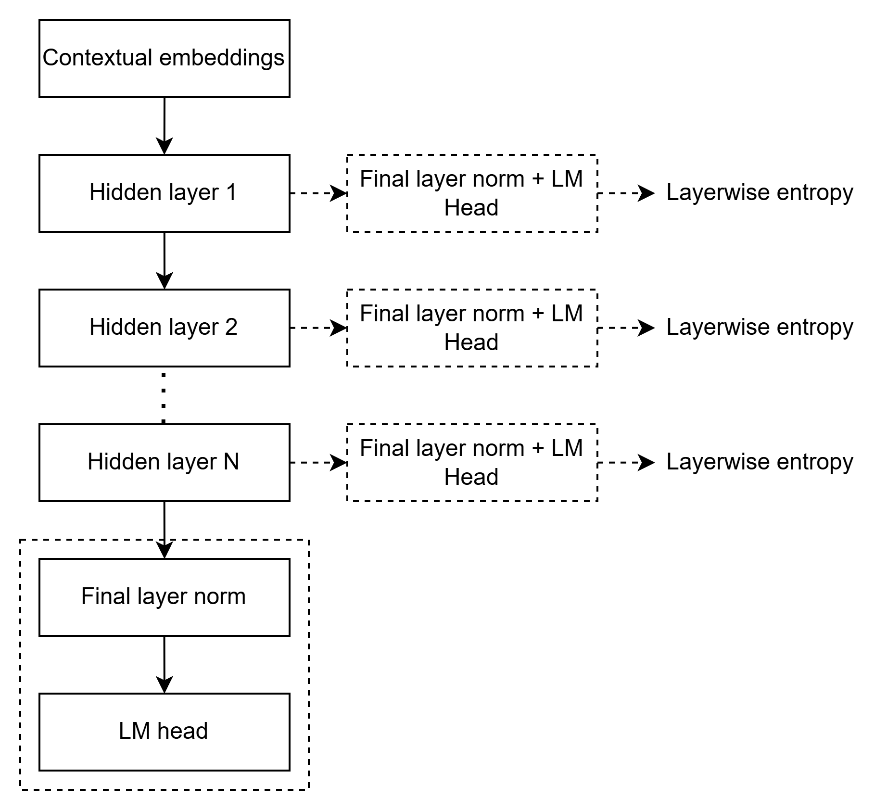

## layerwise-entropy

Official code for the master’s thesis **“Exploring Knowledge Boundaries of LLMs in Specialized Domains.”**  
📄 [Thesis PDF](thesis/ExploringKnowledgeBoundariesOfLlmsInSpecializedDomains.pdf) • 🤗 [HF Collection: Fine-tuned LLMs for Knowledge Boundaries](https://hf.co/collections/kyloren1989/fine-tuned-llms-for-knowledge-boundaries)

### Abstract
In the context of LLMS, the concept of a knowledge boundary refers to the dividing line between regions of known and unknown knowledge. This boundary is not limited to a binary threshold of correct versus incorrect output but encompasses the extent to which the model analyzes input and produces responses that are truthful and faithful. Despite the progress of SOTA LLMs, some of which surpass human performance in domain-specific tasks, the assurance of consistent truthfulness and faithfulness remains unresolved.

This thesis introduces **layerwise entropy**, a metric designed to capture the internal representations of LLMs and evaluate the degree to which each layer is effectively utilized during inference. The method integrates entropy measurements across hidden states, from raw contextual embeddings through intermediate layers, enabling the detection of instability within the model.

By decoding raw score logits and applying inference across multiple architectures, including Transformer, Mamba, and LIV-STAR models, this research investigates the entropy distribution across layers. The analysis highlights differences between regions of known and unknown (near-OOD) knowledge and explores how such differences may signal hallucinations. Ultimately, layerwise entropy is proposed as a step toward mitigating hallucinations by deepening our understanding of the internal dynamics of LLMs.

## Table of Contents
- [Repo Structure](#repo-structure)
- [Environments & Requirements](#environments--requirements)
- [Quickstart](#quickstart)
- [Tasks & Datasets](#tasks--datasets)
- [Pipeline](#pipeline)
- [Results & Figures](#results--figures)
- [Troubleshooting](#troubleshooting)
- [Cite](#cite)
- [License](#license)
- [Acknowledgments](#acknowledgments)

---

## Repo Structure
```
layerwise-entropy/
├─ dataset/                         # LexGLUE dataset
├─ figures/                         # plots/diagrams for the paper & README
├─ result/                          # metrics, logs, aggregated CSVs/JSONs
├─ thesis/                          # thesis PDF
├─ 1_finetune_lfm.py                # finetune LIV-STAR (LFM2) script
├─ 1_finetune_llama_sft.py          # finetune Llama-3.1 script (PEFT/SFT)
├─ 1_finetune_ssm_sft.py            # finetune Mamba/SSM script (PEFT/SFT)
├─ 2_inference_model.py             # inference for models
├─ 3_evaluate_model.py              # evaluation helper
├─ 4_calculate_layerwise_entropy.py # layerwise entropy
├─ 5_aggregate.py                   # for line-series plots
├─ lfm_requirements.txt
├─ unsloth_llama_requirements.txt
├─ zamba_requirements.txt
├─ DATASET_LICENSE.md
├─ MODEL_LICENSES.md
├─ LICENSE
└─ README.md
```

---

## Environments & Requirements
Create **separate Python envs** per architecture (they have distinct dependency stacks):

| Model family | Example HF model | Env name | Requirements file | Entrypoints |
|---|---|---|---|---|
| Transformer (Llama) | `unsloth/Meta-Llama-3.1-8B-Instruct` | `llama-env` | `unsloth_llama_requirements.txt` | `1_finetune_llama_sft.py` |
| Mamba / SSM (Zamba2) | `Zyphra/Zamba2-7B-Instruct-v2` | `zamba-env` | `zamba_requirements.txt` | `1_finetune_ssm_sft.py` |
| LIV-STAR (LFM2) | `LiquidAI/LFM2-1.2B` | `lfm-env` | `lfm_requirements.txt` | `1_finetune_lfm.py` |

**Create envs**
```bash
# Llama
py -3.10 -m venv llama-env
source llama-env/bin/activate
pip install -r unsloth_llama_requirements.txt

# Zamba/Mamba
py -3.10 -m venv zamba-env
source zamba-env/bin/activate
pip install -r zamba_requirements.txt

# LFM2 / LIV-STAR
py -3.10 -m venv lfm-env
source lfm-env/bin/activate
pip install -r lfm_requirements.txt
```

**Sidenote: cloning for large training data**

This repo includes large training data via **Git LFS**. To get the datasets locally, clone with LFS enabled:

```bash
# 1) Make sure Git LFS is installed
git lfs install

# 2) Clone the repo
git clone https://github.com/ongxx107/layerwise-entropy.git
cd layerwise-entropy

# 3) Pull LFS objects (large files)
git lfs pull
```

If you prefer not to download the full datasets, skip the `git lfs pull` step and set your data paths to external copies.

---

## Quickstart
Below shows the **minimal** end-to-end for Llama (example). Replace `model`, `data directory`, and `hyperparameters` for your setup.

```bash
# 1) Finetune (example: Llama)
source llama-env/bin/activate
python 1_finetune_llama_sft.py

# 2) Inference
python 2_inference_model.py

# 3) Evaluate (accuracy / macro-F1 depending on task)
python 3_evaluate_model.py

# 4) Layerwise entropy
python 4_calculate_layerwise_entropy.py

# 5) Aggregate for plots/tables
python 5_aggregate.py
```

Do the analogous steps in `zamba-env` and `lfm-env` using their entrypoints.

---

## Tasks & Datasets
Primary: **ECtHR-A**, **ECtHR-B**, and **CaseHOLD**.  
Unknown (near-OOD) probes: **LEDGAR**, **UNFAIR-ToS**, **SCOTUS**.  
All rendered via a standardized multiple-choice interface (A–J, A–E, etc.) and evaluated with task-appropriate metrics (accuracy or macro-F1). See the thesis for details.

---

## Pipeline
1. **Finetune** (LoRA/PEFT) using the task-specific training split.  
2. **Inference** on **test**.  
3. **Evaluate**:  
   - CaseHOLD → Accuracy  
   - ECtHR-A/B → Macro-F1
4. **Layerwise Entropy**: project hidden states through the tied language head at each layer; compute **entropy** + **variational entropy** on test, paraphrased, and unknown subsets; aggregate across positions to obtain layer profiles for **known vs unknown** comparisons.  
5. **Aggregate & Plot**: produce line-series plots for figures in `figures/`.

---

## Results & Figures
All results and figures are available in the [result](result/) and [figures](figures/) directories.

<p align="center">
  <br>
  <b>Architecture used to compute layerwise entropy in a decoder-only model</b>
</p>

---

## Troubleshooting
- **Zamba2 attention mask**: ensure an explicit `attention_mask` during Layerwise Entropy calculation to avoid degraded results.  

---

## Cite
If you use this repo, please cite the thesis:

```bibtex
@mastersthesis{ong2025layerwise-entropy,
  title        = {Exploring Knowledge Boundaries of LLMs in Specialized Domains},
  author       = {Ren Jeik Ong},
  school       = {Technical University of Munich},
  year         = {2025},
  type         = {Master's Thesis},
  address      = {Munich, Germany},
  url          = {https://github.com/ongxx107/layerwise-entropy}
}
```

---

## License
Code is licensed under MIT (see `LICENSE`). 
Fine-tuned weights are subject to the base model licenses listed in `MODEL_LICENSES.md`. 
Datasets are governed by their original licenses; see `DATASET_LICENSE.md`. 

---

## Acknowledgments
Thanks to Prof. Dr. Georg Groh (examiner) and Tobias Eder (supervisor). See acknowledgments in the thesis for full credits.